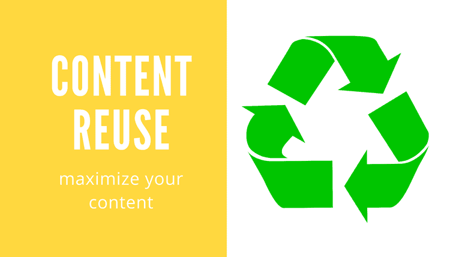
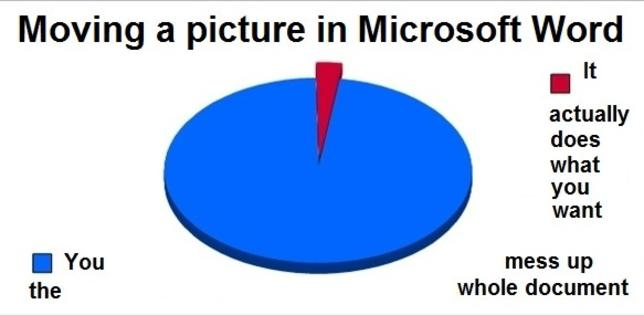

How do you know if an authoring tool is right for you?

I spent several years using [MadCap Flare](https://www.madcapsoftware.com/products/flare/) at my last company. When I first started, I inherited it from the previous tech writer. As this was still early in my career, I was ecstatic to be using such a sophisticated authoring tool. I could set up my own style sheets. I could output to multiple formats from the same source files. I could integrate screen captures easily with MadCap Capture. It was a far cry from the basic tools I had used up till then, tools that could be described as being of the "My First Authoring Tool" variety. MadCap Flare was a tool for serious tech writers and thus, it was a sign that I had become a serious tech writer.

Unfortunately, it was the wrong tool for us. But why was it the wrong tool?

## Issues with MadCap Flare

The greatest asset of MadCap Flare is that it allows you to re-use content. Imagine you have 10 different versions of a product. Each version shares many similarities with slight differences in functionality. As such, you need 10 guides that are largely identical but still account for those differences.

With a traditional authoring tool like Microsoft Word, you would need to produce and maintain 10 separate files. If an edit needed to be made that affected all versions--for example, the language on a disclaimer was modified--you would need to make that edit in 10 files. This is repetitive, time-consuming, and prone to error.

With MadCap Flare, you could create 10 guides from a single source file. Differences in text could be managed by setting up variables, ensuring that each guide has the information specific to a product version. If a universal edit was needed, it could be made once in the source file and that edit would be distributed to all guides. This saves time and reduces the likelihood of errors.

While this functionality makes Flare a powerful authoring tool indeed, I failed to recognize a basic fact about our products--we didn't have 10 versions of the same product. Our software applications were cloud-based apps accessed from a web browser. Each app maintained one running version at any given time. Clients didn't have the option to keep one version or upgrade to another. When new features and updates were released, these were automatically released to all clients. Flare's content re-use features were impressive but there was little need for us to re-use content.

On the other hand, Flare was actually a hindrance to collaboration, something that I've come to appreciate [more](/samples/internalwiki) and [more](/posts/pointlessmeetings). We only had Flare licenses for the tech writing team. As such, only tech writers could edit documentation. While this could be seen as an asset since it allowed tech writers more control over documentation, it prevented others from making even simple edits. If the tech writing team was particularly busy at the time, this stopped changes from being made.

Flare also made content reviews more difficult. Content reviews required tech writers to output drafts to Word doc or PDF to send to reviewers. Unfortunately, Flare's output to Word was unreliable. Flare often rendered graphics poorly in Word. Word docs were also littered with formatting issues. Flare's PDF output worked much better. But with PDF, reviewers couldn't make direct edits. After receiving feedback, the tech writers would need to edit the documentation in Flare themselves. Reviewers were less comfortable working with PDFs compared to Word docs because they couldn't make direct edits.

We could have acquired MadCap Contributor licenses to facilitate content reviews. But it was hard to imagine reviewers would have the time, energy, and patience to learn Flare just to review technical documentation. It was harder still to justify a business case to acquire the licenses in the first place.

## Benefits of MadCap Flare

If MadCap Flare was the wrong tool, why did we continue using it?

Flare's content reuse features did provide limited value for us. Although they didn't fit our needs for software documentation, these features helped us manage our hardware documentation more effectively. Unlike our software applications, our hardware devices were indeed multiple iterations of the same core product, requiring different versions of documentation. In addition, there was a need to produce hardware guides for different regions as we looked to expand our product globally.

In addition, Flare rendered images and graphics consistently, compared to tools like Microsoft Word. Anyone who has created graphics-rich documentation in Word knows that Word struggles with graphics. Sometimes, images don't render correctly. Other times, the location of images on the page seems to change at random. Pages that look perfect on your computer screen often turn into jumbled messes on your coworker's screen.

By contrast, Flare's behavior is much more stable. In Flare, you're technically editing HTML files that follow a CSS style sheet. Even when you're producing documentation in a print format such as PDF, Flare translates the HTML files with a print-specific CSS. Because of this, content in Flare follows reliable HTML and CSS standards. A document that looks perfect on your screen will look perfect on another screen.

Still, the value of these benefits was modest. Hardware documentation made up a small percentage of our product documentation. Further, the number of guides needed for different devices
and regions was relatively low. Although Flare handles graphics more reliably than Word, it also requires knowledge of HTML and CSS. This was another hurdle towards greater collaboration. Despite its issues, Microsoft Word would've enabled collaboration by ubiquity alone.

MadCap Flare was the wrong authoring tool for our business needs. It offered advanced content re-use features that we had little use for. Further, it hindered collaboration as a specialized tool that required training and access that others did not have. When evaluating authoring tools for your company, you must be honest about your business needs and a tool's ability to meet those needs.